# Industrial Anomaly Detection
| Details            |                 |
|-----------------------|------------------|
| Target OS:            |  Ubuntu* 18.04 LTS     |
| Time to complete:     |  3 hours      |

## Introduction
Factories use existing PLCs to control equipment and may use several different devices for the human machine interface (HMI), data ingestion, and computer vision application. This reference implementation demonstrates how all these workloads can run independently on one system. A Kernel-based virtual machine (KVM) on a host system runs multiple virtual machines (VMs) or guests. The [object flaw detector](https://github.com/intel-iot-devkit/object-flaw-detector-python) and the [motor defect detector](https://github.com/intel-iot-devkit/motor-defect-detector-cpp) applications are deployed on these virtual machines. Data visualization occurs on Grafana* on the third virtual machine.  For a high level overview of workload consolidation see the [Workload Consolidation in Industrial IoT](https://software.intel.com/en-us/articles/workload-consolidation-in-industrial-iot) article.

## Requirements

### Hardware
[IEI Tank* AIoT Developer Kit](https://software.intel.com/en-us/iot/hardware/iei-tank-dev-kit)

### Software
* Ubuntu 18.04
* InfluxDB* v1.7.1
* Grafana* v5.3.2

## How It Works

In this application, KVM creates three guest VMs on a host machine. Each virtual machine runs with Ubuntu 18.04 as the operating system. The first machine, named OFD, runs the object flaw detector application. The object flaw detector application detects anomalies on the objects moving on a conveyer belt and stores this data locally on InfluxDB. The second machine, named MDD, hosts the motor defect detector application which also stores the data locally on InfluxDB. Data visualization occurs on Grafana* on the third virtual machine, HMI, using data from OFD and MDD InfluxDB.

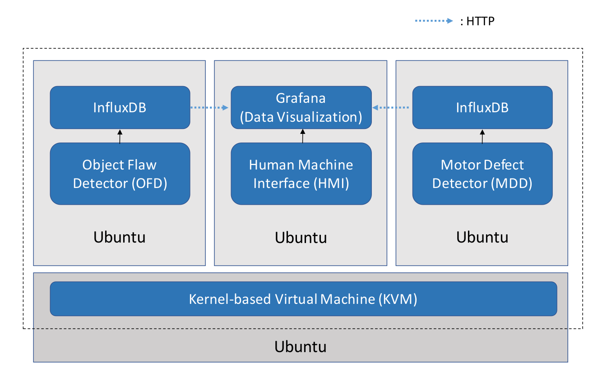

## Setup

### Create Virtual Machines 
1. Ensure that virtualization is enabled in BIOS using the command:
	```
	kvm-ok
	```
	If the output of the above command is
	```
	INFO: /dev/kvm exists
	KVM acceleration can be used
	```
	then the virtualization is enabled. If not and the output contains
	```
	INFO: KVM (vmx) is disabled by your BIOS
	HINT: Enter your BIOS setup and enable Virtualization Technology (VT),
      and then hard poweroff/poweron your system
	```
	then enter the BIOS and enable the virtualization.

2. Install the required packages:
	```
	sudo apt-get install qemu-kvm libvirt-bin ubuntu-vm-builder virt-manager bridge-utils
	```

3. Add your username to the libvirtd group:
	```
	sudo adduser `id -un` libvirtd
	```

4. Reboot the system to make your user an effective member of *libvirtd* user group.

5. To create virtual machine with Ubuntu 18.04 as a guest operating system, download 64-bit PC desktop ubuntu image from [Ubuntu 18.04 LTS](http://releases.ubuntu.com/18.04/).

6. Create a directory for storage pool: 
	```
	mkdir $HOME/kvm-pool
	```
	It will create a directory named **kvm-pool** in **HOME** directory.

7. Open virt-manager:
	```
	virt-manager
	```
8. To create virtual machine for object flaw detector application (OFD):
	* Go to **File > New Virtual Machine**. It will open a new dialogue window.

		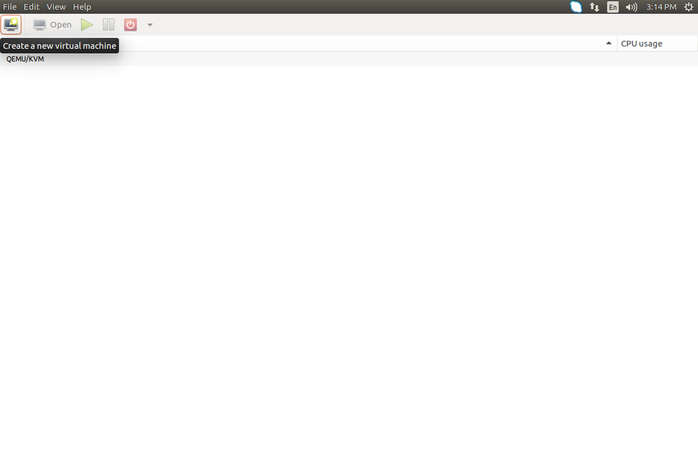	

	* Select **Local Install Media** and then click on Forward button.

		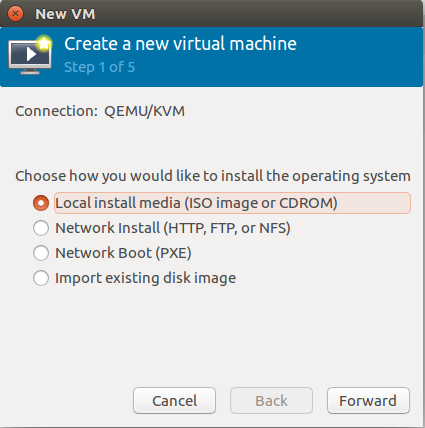	

	* Under *Locate your install media*, select **Use ISO image** and click on Browse button. This will open *Choose Storage Volume* window.

	* Click on **Browse Local** button present at the bottom of the window and browse to the Ubuntu ISO image downloaded earlier. Click on Forward button. 

		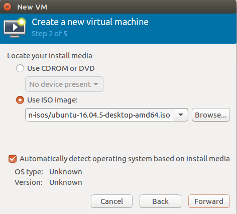	

	* In the next window set *Memory(RAM)* to **1024 MiB** and *CPUs* to **4**, then click on Forward Button. You may need to increase the memory(RAM) of the VM to 4096 MiB temporarily when compiling the code samples and change back to 1024 MiB after.

		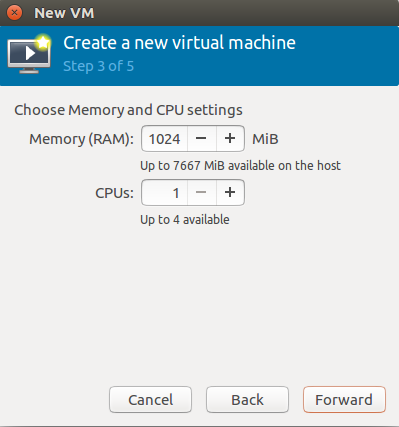 

	* Choose **Select or create custom storage** and click on **Manage...**.

		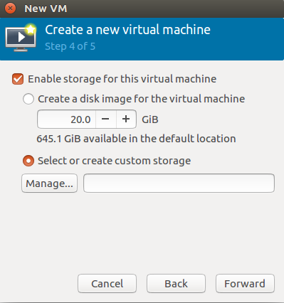 

	* Click on the Green **+** button present on the bottom left on *Choose Storage Volume* window, which will open *Add a new Storage pool* window.

	* Select **dir: Filesystem Directory** type and give *kvm-pool* as the name of the storage pool. Click on Forward button. 

		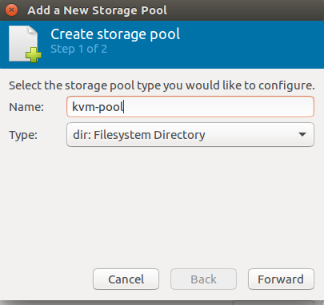 

	* Click on Browse button and browse to the kvm-pool directory which was created in step 6. It will be the target path.

		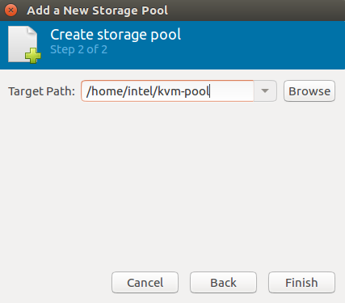 

	* Click on **Finish**. It will open *Choose Storage Volume* window again. The new storage pool created i.e. *kvm-pool* will appear on the left panel.

	* To create the storage volume for OFD, select the *kvm-pool* from left panel. Click on the Green **+** button present on the right panel beside **Volumes**. It opens *Add a Storage Volume*  window.

	* Give **OFD** as the storage volume name and **20** GB as the max capacity, then click on the Finish button.

		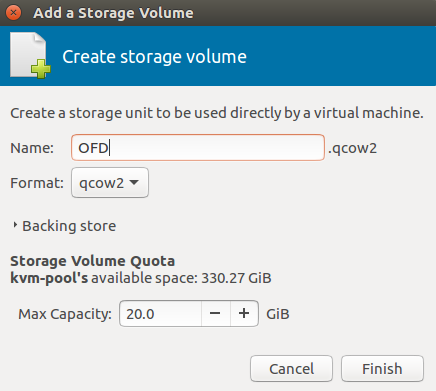 

	* Select *OFD.qcow2* storage volume from *kvm-pool* storage pool in *Choose Storage Volume* and click on the **Choose Volume** button. 

	* In *New VM* window, click on the Forward button.

		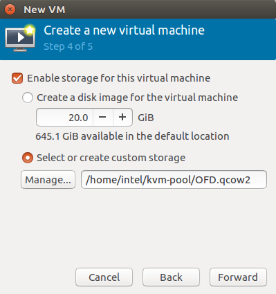 

	* In the next window, name the virtual machine as OFD and click on the Finish button. It will start a new virtual machine.

		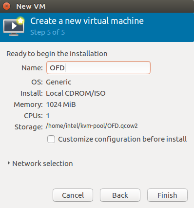 

	* The final step of creating the virtual machine is to install Ubuntu. Follow the steps given in the below link to install Ubuntu:<br>
	https://tutorials.ubuntu.com/tutorial/tutorial-install-ubuntu-desktop#2. 

		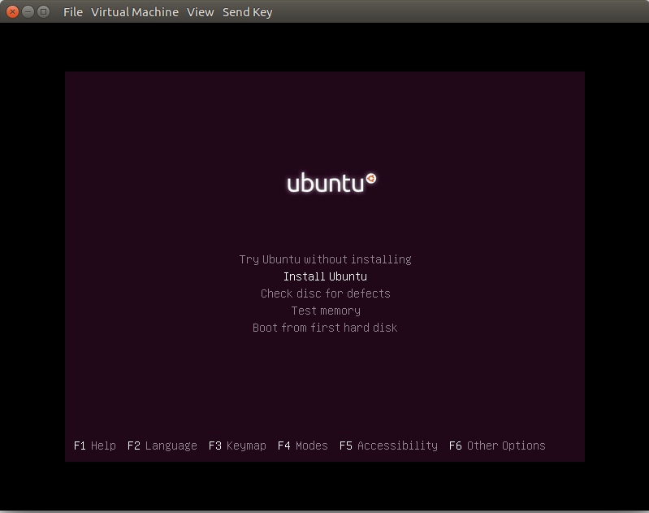 

	  
9. Similarly, create two new VMs for the Motor Defect Detector (MDD) and Human Machine Interface (HMI) applications. Create the storage volume for MDD and HMI in the *kvm-pool* storage pool created in the previous step.

10. To turn on the virtual machine, select the machine from virtual machine manager and click on green **play** icon present on the top menu. Double click on the machine name to open the VM window.

	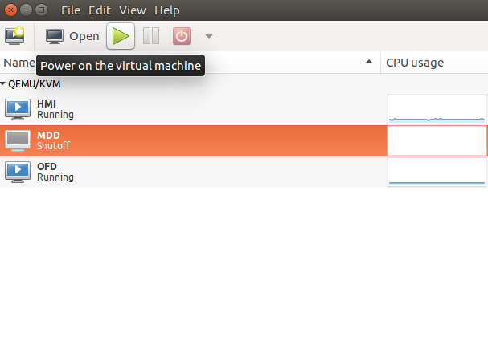
 

### Run the Applications on the Virtual Machines

* For the OFD machine, get the source code of the OFD application from the [GitHub* repository.](https://github.com/intel-iot-devkit/object-flaw-detector-python)
	
* Follow the object flaw detector readme to run the application. Skip the steps for installing Grafana and creating the dashboard in grafana for data visualization.

* For the MDD machine, get the motor defect detector code from the [GitHub* repository.](https://github.com/intel-iot-devkit/motor-defect-detector-cpp)

* Follow the motor defect detector readme to run the application for testing the Bearing Data Set. Skip the steps for installing Grafana and creating the dashboard in Grafana for data visualization.

* On the third machine, i.e. HMI machine, install Grafana:
	```
	wget https://s3-us-west-2.amazonaws.com/grafana-releases/release/grafana_5.3.2_amd64.deb
	sudo apt-get install -y adduser libfontconfig
	sudo dpkg -i grafana_5.3.2_amd64.deb
	``` 
* In the HMI Machine, visualize the data on Grafana for the OFD and MDD applications by following the steps given below:  

	* Download the workload-consolidation repository in HMI from the [GitHub* repository.](https://github.com/intel-iot-devkit/Industrial-Workload-Consolidation)

	* Run the Grafana server:
		```
		sudo /bin/systemctl start grafana-server
		```
	* Open a browser, go to http://localhost:3000.

	* Log in with user as **admin** and password as **admin**.

	* Click on **Configuration** icon present on the left panel.

	* Click on **+ Add data source** button and provide the inputs below.<br>

		Add data source from OFD:
		* *Name*: obj_flaw_database
		* *Type*: InfluxDB
		* *URL*: http://<OFD_machine_ip_address>:8086
		* *Database*: obj_flaw_database
		* Click on “Save and Test”

		Click on **Back** button present on bottom and then click on **Add data source**.<br>
		Add data source from MDD for data set "1st_test":
		* *Name*: Predictions_testset1
		* *Type*: InfluxDB
		* *URL*: http://<MDD_machine_ip_address>:8086
		* *Database*: Predictions_testset1 
		* Click on “Save and Test”

		Click on **Back** button present on bottom and then click on **Add data source**.<br>
		Add data source from MDD for data set "2nd_test":
		* *Name*: Predictions_testset2
		* *Type*: InfluxDB
		* *URL*: http://<MDD_machine_ip_address>:8086
		* *Database*: Predictions_testset2 
		* Click on “Save and Test”

    * Click on the **+**  icon present on the left side of the browser, select **import**.

    * Click on the **Upload.json File** button.

    * Browse and select the file "motor_1_and_product_flaw_detector.json" present in Workload Consolidation directory.

	* Give the name as "motor_1_and_product_flaw_detector".

    * Select "obj_flaw_database" data source in the *obj_flaw_database* field under **options** and "Predictions_testset1" data source in the *Predictions_testset1* field.

		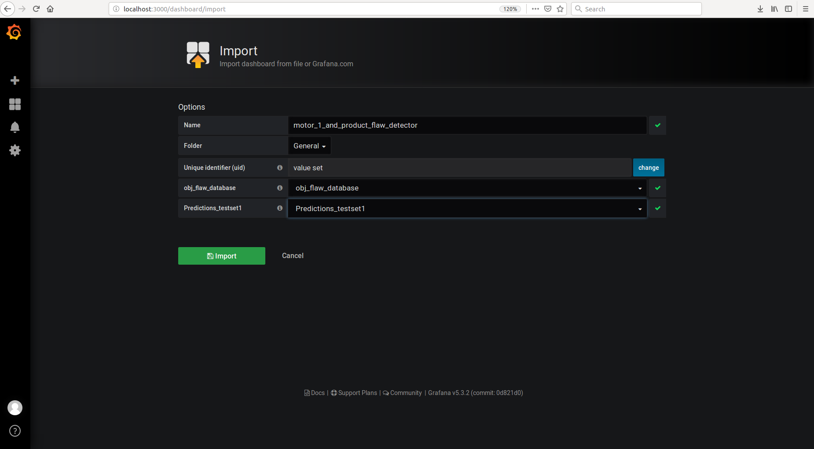	

    * Click on import to create a dashboard that visualizes the result of the object flaw detector and the result of data set "1st_test" from the MDD application.
	* Similarly, import "motor_2_and_product_flaw_detector.json" present in the workload-consolidation directory and name it as "motor_2_and_product_flaw_detector". Select "obj_flaw_database" data source in the *obj_flaw_database* field under **options** and "Predictions_testset2" data source in the *Predictions_testset2* field. 
	* It will create a dashboard that visualizes the result of the object flaw detector and the result of data set "2nd_test" from the MDD application.

* Run the motor defect detector application on MDD machine and the object flaw detector application on OFD machine. In the third machine, HMI, visualization of the data from two applications can be seen on the dashboard created in the previous step.

	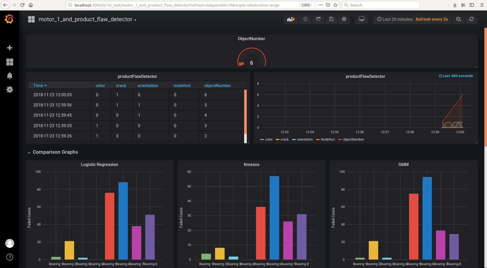

**NOTE:** 
1. The results of object flaw detector and data set "1st_test" in motor defect detector are visualized on the dashboard named "motor_1_and_product_flaw_detector".
2. The results of object flaw detector and data set "2nd_test" in motor defect detector are visualized on the dashboard named "motor_2_and_product_flaw_detector".
		
